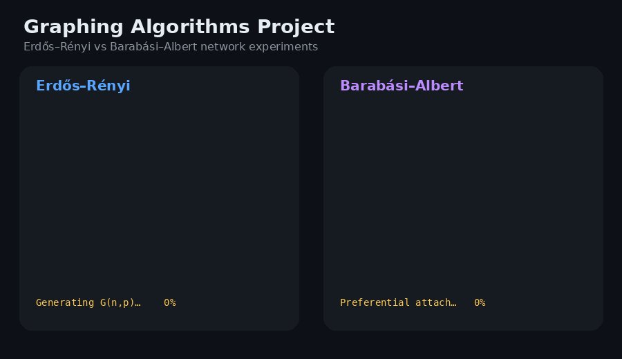

# Graphing Algorithms Project

An experimental C++ project for studying structural properties of synthetic networks.

It generates **Erdős–Rényi** and **Barabási–Albert** graphs, then measures:

- graph diameter;
- global clustering coefficient;
- degree distribution.

## Demo



*Terminal replay of an actual `./run.sh` build/run and the generated CSV files. Output is captured from the C++ executable, with pauses added for readability. This project is a CLI experiment; it does not have a graphical network UI.*

## Build and run

```bash
./run.sh
```

The default run uses small/medium graph sizes so the project finishes in a practical amount of time and writes CSV files to `data_All/`.

To reproduce the original large experiment:

```bash
./run.sh --full
```

You can choose another output folder:

```bash
./run.sh --output results
```

## Test

```bash
g++ -std=c++17 -O2 -Wall -Wextra -pedantic \
  -o graph_tests \
  tests.cpp graph.cpp graph_algorithms.cpp erdos_renyi.cpp barabasi_albert.cpp
./graph_tests
```

The tests use known small graphs to verify diameter, triangle counting, clustering coefficient, degree distribution, unreachable distances, and duplicate-edge handling.

## Implementation notes

- Erdős–Rényi generation uses an edge-skipping algorithm rather than checking every possible pair.
- Barabási–Albert generation uses degree-proportional sampling with distinct targets for each new vertex.
- Large-graph diameter uses several double-sweep BFS passes as an approximation.
- Triangle counting counts each triangle exactly once using increasing node IDs.

The original experimental report is preserved in `Graphing_report.pdf`.

## Re-record the demo

```bash
pip install pillow
python scripts/generate_demo.py
```

Requires Bash and a C++17 compiler, as does the application. The recorder builds/runs the actual project, reads its generated CSVs, and verifies graph sizes and degree/edge consistency before rendering the captured terminal text to GIF. It does not substitute NetworkX graphs or invented metrics. **Actions → Generate demo GIF** can refresh it manually.
